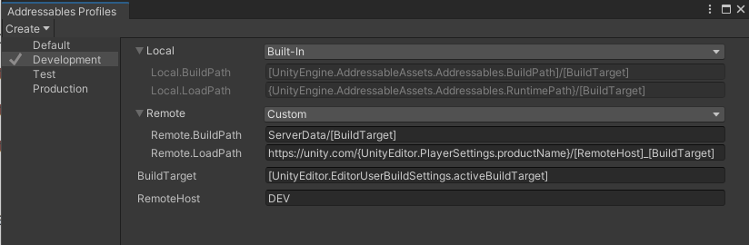
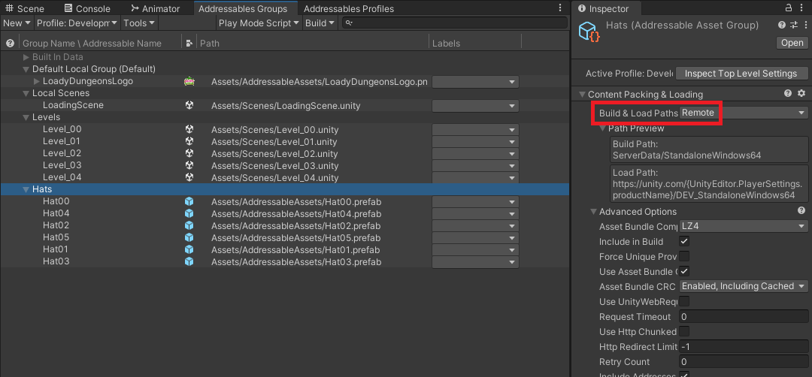

# MY NOTES

> ## Why should you use Addressables
>
> 1. `Flexibility`: from local to remote, from a monolithic bundle to more granular bundles
> 2. `Dependency Management`: automatically loads all dependencies of any assets you load
> 3. `Memory Management`: as you load assets into and out of your game in scripts, the system keeps track of memory allocation
> 4. `Efficient Content Packing`
> 5. `Cloud Build and Content Delivery`: integrated into Unity Gaming Services (UGS), specifically Cloud Content Delivery and Cloud Build
> 6. `Scriptable Build Pipeline (SBP)`
> 7. `Localization`

- Window > Asset Management > Addressables > Groups
- Window > Asset Management > Addressables > Profiles
- When we `load assets (a list) by a label`, instead of releasing the instance and the asset, we keep all the assets in memory and randomly pick again

## Several Ways to Load Prefabs

### 1) Original Way - `Resources.LoadAsync` (Deprecated)

```csharp
public class PlayerConfigurator : MonoBehaviour
{
    [SerializeField]
    private Transform m_HatAnchor;

    private ResourceRequest m_HatLoadingRequest;  // <--

    private void Start()
    {
        SetHat(string.Format("Hat{0:00}", GameManager.s_ActiveHat));
    }

    public void SetHat(string hatKey)
    {
        m_HatLoadingRequest = Resources.LoadAsync(hatKey);  // <--
        m_HatLoadingRequest.completed += OnHatLoaded; // <--
    }

    private void OnHatLoaded(AsyncOperation asyncOperation)
    {
        Instantiate(m_HatLoadingRequest.asset as GameObject, m_HatAnchor, false);
    }

    private void OnDisable()
    {
        if (m_HatLoadingRequest != null)
        {
            m_HatLoadingRequest.completed -= OnHatLoaded;
        }
    }
}
```

### 2) `Addressables.LoadAssetAsync(string)`

```csharp
public class PlayerConfigurator : MonoBehaviour
{
    // ...

    [SerializeField]
    private string m_Address; // <--

    private AsyncOperationHandle<GameObject> m_HatLoadOpHandle; // <--

    private void Start() { ... }

    public void SetHat(string hatKey)
    {
        m_HatLoadOpHandle = Addressables.LoadAssetAsync<GameObject>(m_Address); // <--
        m_HatLoadOpHandle.Completed += OnHatLoadComplete; // <--
    }

    private void OnHatLoadComplete(AsyncOperationHandle<GameObject> asyncOperationHandle)
    {
        if (asyncOperationHandle.Status == AsyncOperationStatus.Succeeded)
        {
            Instantiate(asyncOperationHandle.Result, m_HatAnchor);
        }
    }

    private void OnDisable()
    {
        m_HatLoadOpHandle.Completed -= OnHatLoadComplete; // <--
    }
}
```

### 3) `AssetReference`

```csharp
public class PlayerConfigurator : MonoBehaviour
{
    // ...

    [SerializeField]
    private AssetReference m_HatAssetReference; // <--

    // ...

    public void SetHat(string hatKey)
    {
        if (!m_HatAssetReference.RuntimeKeyIsValid()) // <--
        {
            return;
        }

        m_HatLoadOpHandle = m_HatAssetReference.LoadAssetAsync<GameObject>(); // <--
        m_HatLoadOpHandle.Completed += OnHatLoadComplete;
    }

    // ...
}
```

### 4) `AssetReferenceGameObject`

```csharp
public class PlayerConfigurator : MonoBehaviour
{
    // ...

    [SerializeField]
    private AssetReferenceGameObject m_HatAssetReference; // <--

    // ...

    public void SetHat(string hatKey)
    {
        // ...

        m_HatLoadOpHandle = m_HatAssetReference.LoadAssetAsync(); // <--
        m_HatLoadOpHandle.Completed += OnHatLoadComplete;
    }

    // ...
}
```

## Load Scene

```csharp
private static AsyncOperationHandle<SceneInstance> m_SceneLoadOpHandle;

public static void LoadNextLevel()
{
    // SceneManager.LoadSceneAsync("LoadingScene");

    m_SceneLoadOpHandle = Addressables.LoadSceneAsync("LoadingScene", activateOnLoad: true);
}
```

## Load Assets by Labels 

### Load Locations

```csharp
private GameObject m_HatInstance;

// Also can load all assets directly: <IList<GameObject>>
private AsyncOperationHandle<IList<IResourceLocation>> m_HatsLocationsOpHandle;

private AsyncOperationHandle<GameObject> m_HatLoadOpHandle;
private List<string> m_Keys = new() { "Hats", "Fancy" };

private void Start()
{
    m_HatsLocationsOpHandle = Addressables.LoadResourceLocationsAsync(m_Keys, Addressables.MergeMode.Intersection);
    m_HatsLocationsOpHandle.Completed += OnHatLocationsLoadComplete;
}

private void Update()
{
    if (Input.GetMouseButtonUp(1))
    {
        Destroy(m_HatInstance);
        Addressables.Release(m_HatLoadOpHandle);
        LoadInRandomHat(m_HatsLocationsOpHandle.Result);
    }
}

private void OnDisable()
{
    m_HatLoadOpHandle.Completed -= OnHatLoadComplete;
    m_HatsLocationsOpHandle.Completed -= OnHatLocationsLoadComplete;
}

private void OnHatLocationsLoadComplete(AsyncOperationHandle<IList<IResourceLocation>> asyncOperationHandle)
{
    Debug.Log("AsyncOperationHandle Status: " + asyncOperationHandle.Status);

    if (asyncOperationHandle.Status != AsyncOperationStatus.Succeeded)
    {
        return;
    }

    var results = asyncOperationHandle.Result;
    foreach (var r in results)
    {
        Debug.Log("Hat: " + r.PrimaryKey);
    }

    LoadInRandomHat(results);
}

private void OnHatLoadComplete(AsyncOperationHandle<GameObject> asyncOperationHandle)
{
    if (asyncOperationHandle.Status == AsyncOperationStatus.Succeeded)
    {
        m_HatInstance = Instantiate(asyncOperationHandle.Result, m_HatAnchor);
    }
}

private void LoadInRandomHat(IList<IResourceLocation> resourceLocations)
{
    var randomIndex = Random.Range(0, resourceLocations.Count);
    var randomHatPrefab = resourceLocations[randomIndex];

    m_HatLoadOpHandle = Addressables.LoadAssetAsync<GameObject>(randomHatPrefab);
    m_HatLoadOpHandle.Completed += OnHatLoadComplete;
}
```


## Profiles



- `Square Brackets [ ]`: denote that values of `other profile variables` should replace everything within the brackets (including the brackets) at the time that the content gets built. (引用其他 Profile 的變數或者程式碼變數)
- `Curly Braces { }`: denote the values of `public static fields` from your game scripts should replace everything within the brackets (including the brackets) at time of Addressables’ runtime initialization. (放 runtime 程式碼的變數，可能會根據平台不同而變化，但不支持 Editor namespace 的變數)
- 注意: 如果程式碼中的變數只有被 Profile 引用，程式碼構建的時候，這個變數還是會被剝離 ([來源](https://zhuanlan.zhihu.com/p/499172933))

```
BuildTarget =
'[UnityEditor.EditorUserBuildSettings.activeBuildTarget]' ->
'StandaloneWindows64' ->
'StandaloneWindows64'

Local.BuildPath =
'[UnityEngine.AddressableAssets.Addressables.BuildPath]/[BuildTarget]' ->
'Library/com.unity.addressables/aa/Windows/StandaloneWindows64' ->
'Library/com.unity.addressables/aa/Windows/StandaloneWindows64'

Local.LoadPath =
'{UnityEngine.AddressableAssets.Addressables.RuntimePath}/[BuildTarget]' ->
'{UnityEngine.AddressableAssets.Addressables.RuntimePath}/StandaloneWindows64' ->
'Library/com.unity.addressables/aa/Windows/StandaloneWindows64'

Remote.BuildPath =
'ServerData/[BuildTarget]' ->
'ServerData/StandaloneWindows64' ->
'ServerData/StandaloneWindows64'

Remote.LoadPath =
'https://unity.com/{UnityEditor.PlayerSettings.productName}/[RemoteHost]_[BuildTarget]' ->
'https://unity.com/{UnityEditor.PlayerSettings.productName}/DEV_StandaloneWindows64' ->
'https://unity.com/LoadyDungeons/DEV_StandaloneWindows64'

RemoteHost = 'DEV' -> 'DEV' -> 'DEV'
```
## Schemas
- [Unity Addressables 學習
](https://zhuanlan.zhihu.com/p/499172933)
- Content Packing & Loading
- Content update restrictions
- Resources and built in scenes

